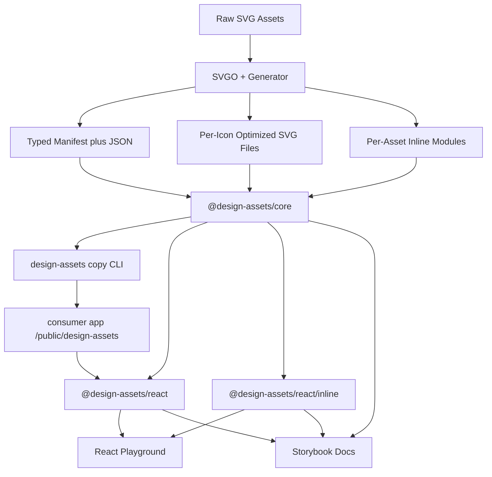

# Design Assets Case Study Implementation Plan

> **For agentic workers:** REQUIRED SUB-SKILL: Use `superpowers:subagent-driven-development` (recommended) or `superpowers:executing-plans` to implement this plan task-by-task. Steps use checkbox (`- [ ]`) syntax for tracking.

**Goal:** Build a portable, type-safe enterprise design assets system that manages icons, pictograms, illustrations, and brand assets via per-icon optimized SVG files, a typed manifest, React wrappers for both external-file (`<use href>`) and inline-in-JS usage, a static copy-to-public workflow, and strong documentation.

**Architecture:** One standalone Yarn workspaces + Turborepo monorepo. Keep `@design-assets/core` framework-agnostic and publishable. React surface lives in `@design-assets/react` with two entrypoints:

- Default: external-file components that render `<svg viewBox="0 0 24 24"><use href="/design-assets/icons/settings.svg?v=1.4.2#asset" /></svg>`. Browser fetches each asset on demand, caches it per file, and reuses the parsed SVG across all `<use>` references on the page. No JS runtime fetch, no DOM duplication. `currentColor` works because each file uses `fill="currentColor"` on its paths and the wrapper `<svg>` inherits CSS color from its host. The query string is always before the fragment (`file.svg?v=<version>#asset`), otherwise the version tag becomes part of the fragment and cache busting does not work.
- `/inline` subpath: per-asset React components that embed SVG markup directly into the JS bundle for above-the-fold critical icons (logo, primary nav) where you cannot afford a single HTTP request. Tree-shakable. Note: inline duplicates path markup in the DOM on every render, so use sparingly.

Generated per-icon SVG files are copied into consumer apps' `public/` directories via a small CLI helper. Storybook reads generated manifests and acts as the visual catalog, governance surface, and documentation site. Angular is intentionally out of scope; the core is portable enough that an adapter is a follow-up exercise.

**Tech Stack:** Yarn workspaces, Turborepo, TypeScript, tsup for package builds, tsx for scripts, SVGO, Vitest, React 18+, Storybook, Tailwind (docs/playground only).

---

## Key Decisions

- Use **Turborepo + Yarn workspaces**, not Nx. The case study is about portable packages, not workspace tooling.
- Keep the core independent of React, Storybook, Tailwind, Vite, and any framework.
- Public package names:
  - `@design-assets/core` - framework-agnostic source of truth, generator, per-icon SVG output, manifest, types, CLI.
  - `@design-assets/react` - React external-file components (default) + `react/inline` subpath for ATF components.
  - `@design-assets/tailwind-preset` - optional shared Tailwind preset for docs/playground.
  - `@design-assets/typescript-config`, `@design-assets/eslint-config` - internal shared configs.
- Asset categories:
  - `icons`: monochrome UI/system icons, `currentColor`, viewBox `0 0 24 24`. **Single visual family: outline, 1.5px stroke, round cap + round join.** Solid / filled variants are future work, not part of v1.
  - `pictograms`: small content/category visuals, often colored, vector only.
  - `illustrations`: larger empty-state/hero/onboarding visuals, vector only.
  - `brand`: logo marks, app icons, and social marks. Text lockups are handled outside the SVG asset or converted to paths before export.
  - `flags`: country flags named by ISO 3166-1 alpha-2 code (`cz.svg`, `us.svg`). Source comes from a pinned MIT-licensed npm package (`flag-icons`) at generation time, then passes through our generator and manifest. No runtime dependency on the flag package. Original flag colors preserved, no `currentColor` enforcement. Special governance: territorial / political sensitivity reviewed before adding (see `flags-governance.mdx`).
- **Raster and complex media assets are out of scope.** PNG/JPG/WebP/AVIF and any complex SVG (filters, masks, embedded raster, screenshots, detailed marketing artwork, content illustrations that are not simple vector system assets) belong to a separate **media service** (DAM / CMS / Cloudinary / imgix / Sanity / S3 + on-the-fly resize), not to this design-assets system. Design assets are brand and iconography — verifiably source-controlled, deterministic, lifecycle-governed. Media is content — variable, locale-specific, often user-uploaded, on-the-fly transformed. Mixing the two pipelines weakens both. Listed as future-work note, never as a v1 task.
- **Per-icon static SVG files**, not sprites. Each asset is its own optimized file. Browser fetches each file once, caches per file, and `<use href="file.svg#asset">` references it. One HTTP per unique asset shown on a page (HTTP/2 multiplex), then served from cache. No 1-big-blob sprite that downloads unused icons.
- **All assets stay same-origin** by being copied into the consumer's `public/` directory. Avoids `<use href>` CORS pitfalls. No CDN coupling. Easiest portable model.
- **`currentColor` works for external `<use>` references** because the wrapper `<svg>` inherits CSS `color` and the referenced asset's paths use `fill="currentColor"` or `stroke="currentColor"`. This is the explicit reason for the per-icon file format + `<use>` approach over ``.
- **Inline entrypoint** (`@design-assets/react/inline`) is a separate, opt-in path for ATF critical icons where even a single HTTP request is unacceptable. Tree-shakable. Use sparingly because each render duplicates SVG markup in the DOM.
- **No JS runtime fetch + parse + inject pattern.** It adds runtime cost and FOIC. The `<use href>` pattern delegates the fetch to the browser, with native cache and zero JS overhead.
- **Assets are never silently deleted or renamed.** Only added, visually edited, or deprecated. Names are part of the public API: production HTML and copied static files reference them as URLs (`/design-assets/icons/old-icon.svg`). Deletion or rename breaks live consumers in the wild (blog posts, screenshots, indexed pages, third-party embeds), not just code. Deprecation is the only sanctioned path to retirement, and removal — if it ever happens — is a coordinated major event documented for months in advance.
- **Designer-friendly source pipeline.** Source SVGs in `packages/core/src/<category>/` are expected to be exported from Figma via the [SVG Export plugin](https://www.figma.com/community/plugin/814345141907543603) using shared per-category presets that this repo documents. The plugin runs SVGO under the hood and supports `currentColor` natively, so designers can ship icon SVGs that pass our validation rules without hand-editing markup. The plugin is a **recommended workflow, not a build dependency** — hand-authored SVGs that pass validation are also accepted. Our generator still runs its own SVGO pass and validation in CI; the plugin just makes the source step turnkey.
- **Auto cache-busting by default.** The provider's `versionTag` defaults to the running `@design-assets/core` version (read from a generated `version.ts` at build time), so consumers get fresh assets on every package bump with zero config. They can opt out or override.
- Angular wrapper is intentionally out of scope; the core is portable enough that an adapter is a follow-up exercise, not a case-study deliverable.

## Why `<use href>` Instead Of ``, Background Image, Or Mask

The default render strategy is `<svg viewBox="<from manifest>"><use href="/design-assets/<category>/<name>.svg?v=<version>#asset" /></svg>`. Every generated SVG file contains a stable root fragment id (`id="asset"`). This is not an icon-specific id: it is always `#asset` because the same mechanism serves icons, pictograms, illustrations, brand assets, and flags. The alternatives were considered and explicitly rejected:

- **``:** The SVG renders inside a separate document context. CSS color from the host page does **not** inherit. `fill="currentColor"` resolves against the SVG document's own (default black) color. You cannot style monochrome icons with Tailwind text classes, design tokens, or `:hover` color, which defeats the entire icon system. Also limits accessibility control (you must provide `alt`, cannot cleanly mark as decorative the same way).
- **`background-image: url(icon.svg)`:** Same limitation. No `currentColor` inheritance. You'd need a separate CSS class per color variant, which is exactly what a design system is meant to avoid.
- **`mask-image: url(icon.svg); background-color: currentColor`:** Works only for monochrome and requires a per-icon CSS rule or inline style. Removes the SVG from the accessibility tree entirely (it becomes a styled `<div>`), so `aria-label` / `role="img"` semantics get awkward. More moving parts for no real benefit.
- **Raw inline `<svg>` (every render):** Works for color, but duplicates path data in the DOM N times for N usages. This is what the `/inline` entrypoint is reserved for: ATF critical icons only.
- **JS fetch + parse + inject:** Adds runtime cost, can cause FOIC (flash of invisible content), and means JS owns the asset pipeline. Rejected.

**`<use href="external.svg#asset">` is the only option that gives all four at once:**

1. **`currentColor` inheritance.** The referenced SVG is brought into the host document tree as a shadow subtree, so CSS color from the wrapper `<svg>` cascades into the referenced asset's paths. `fill="currentColor"` resolves against the consumer's current text color (Tailwind `text-blue-600`, theme tokens, dark-mode swaps, `:hover`, etc.). This is tested in Chromium and WebKit via Playwright because external SVG references are exactly where browser quirks tend to hide.
2. **No DOM duplication.** N references on the page = N tiny `<svg><use></use></svg>` wrappers. Path data lives once in the browser's parsed SVG cache, not N times in the rendered DOM.
3. **No JS runtime work.** The browser fetches the external file on first reference and caches by URL. Zero JavaScript involvement in the asset lifecycle.
4. **No payload duplication across prerendered pages.** Critical for SSG / SSR-prerendered sites (Astro, Next export, Angular Universal, Hugo, Nx prerender). Every prerendered HTML file is a separate artifact on disk and on the CDN. Inlining the same SVG path data into thousands of pages duplicates those bytes thousands of times. `<use href="/design-assets/icons/settings.svg?v=1.4.2#asset">` keeps each prerendered HTML lean and the icon body stored exactly once in `/public`. See "Storage at scale" below.

### Storage at scale (the SSG / prerender case)

This is the killer scenario for design systems that ship a lot of content pages. The Average product itself is a good example: many market apps × many calculator + content pages = tens of thousands of prerendered HTML files in the final build output.

Concrete back-of-the-envelope numbers, conservative estimates:

- **Inline path data per icon after SVGO:** ~300 bytes (monochrome, 24×24, single path; pictograms / illustrations are larger).
- **Typical icons per content page:** ~10 (nav, footer, content callouts, social links, etc.).
- **Wrapper-only markup per icon for the external-file approach:** ~100 bytes (`<svg viewBox="0 0 24 24" class="size-5 text-blue-600" aria-hidden="true"><use href="/design-assets/icons/settings.svg?v=1.4.2#asset"></use></svg>`).

For a build with **50,000 prerendered HTML pages**:

| Strategy | Per page | Total in build output |
|---|---|---|
| Inline SVG markup in every page | ~3 KB | **~150 MB** of duplicated icon markup on disk and over CDN bandwidth on every cold fetch. |
| `<use href>` to per-icon files | ~1 KB | **~50 MB** of wrappers in prerendered HTML, plus a one-time ~25 KB for the actual SVG files in `/public`. |

Roughly a **3–4x reduction in HTML payload across the build**, dominated by the savings on icons that repeat on every page (nav, footer, region selector). Gzip narrows the gap because the inline markup compresses well, but the savings remain meaningful for build artifacts on disk, S3 / R2 / Pages storage costs, cold-cache TTFB, and parser memory in the browser.

**Crucially, you still get `currentColor` and theme variability.** The naive way to get HTML-size savings would be `` or `background-image`, but both forfeit `currentColor` inheritance and force you to ship one color variant per design token. With `<use href>` you keep the small HTML payload, the per-page CSS-driven color (Tailwind text classes, theme switching, hover states), and the per-icon static file all at once.

**Where the win disappears:**

- For ATF critical icons rendered once per page (logo, primary nav), the inline entrypoint is still preferred because saving one HTTP request beats saving a few hundred bytes of HTML.
- For pages that render the same icon hundreds of times within a single page (e.g., a long table with status icons in every row), `<use href>` is even more dramatic — one fetch, one parsed copy in browser memory, N tiny `<use>` pointers.

**Constraints this introduces (and how we handle them):**

- **Same-origin only** (otherwise CORS preflights / Safari edge cases). The copy CLI puts files into the consumer's `public/`, which is same-origin by definition. Documented in `copying-assets.mdx`.
- **Fragment id required.** `<use>` historically references a specific element inside an external SVG document (`file.svg#id`). Fragmentless `<use href="file.svg">` is SVG2 convenience behavior and is less battle-tested. Always generate a root `id="asset"` and reference `#asset`. The version query must come before the fragment (`file.svg?v=1.4.2#asset`) because everything after `#` is client-side fragment data and is not sent as part of the HTTP cache key.
- **Simple SVG only.** No internal `<style>`, `<filter>`, `<mask>`, or `<clipPath>` dependencies. Safari/WebKit has historical edge cases for external SVG documents with internal styles and filters. This plan avoids those features entirely and verifies the remaining simple path/currentColor case with Playwright WebKit.
- **No IE11.** Not a target.
- **Cross-origin CDN hosting** (a future-work concern) requires CORS headers on the asset host and may have spotty `currentColor` behavior in older Safari. Documented as a caveat, not the default path.

## Asset Source Authoring Rules (For Designers)

These rules govern how source SVGs are prepared in Figma before export. Half of them are auto-enforced by the CI validator (Task 6); the other half are reviewer-enforced because they're aesthetic / cognitive, not structural. The Storybook page `adding-assets.mdx` is the canonical surface for designers.

### Canvas and grid (per category)

| Category | Canvas | Optical bounding box | Stroke width | Pixel grid |
|---|---|---|---|---|
| Icons | 24×24 | 20×20 with 2px safe area | **1.5px (fixed default; matches Heroicons / Phosphor regular)** | snap to whole pixels at 24×24 |
| Pictograms | 48×48 or 64×64 | leave at least 4px safe area | 2px when stroked | snap to whole pixels at base |
| Illustrations | flexible (e.g. 240×160) | document each as-needed | not constrained | snap to .5px allowed |
| Brand | spec'd per asset (logo lockups have their own clear-space rule) | per brand guideline | per brand guideline | per brand guideline |
| Flags | source-defined by pinned flag package (typically normalized UI ratio) | full canvas, no safe area | n/a (not stroked) | n/a |

- **Auto-enforced:** root `viewBox` matches expected category canvas (icons must be `0 0 24 24`); validator fails on mismatch.
- **Designer-enforced:** safe area, pixel-grid snapping, optical bounding box.

### Stroke vs fill discipline (icons)

**v1 default: outline-only family, 1.5px stroke, round cap + round join.** This matches the dominant modern enterprise pattern (Heroicons outline, Phosphor regular, Lucide-class libraries) and matches the visual language already present in the Average codebase. The choice is deliberate and not configurable per icon — every icon shipped in `icons/` must conform.

- **No mixed paradigms in v1.** A solid / filled variant is a paired set that doubles every icon and ships under a different family name (`icons-solid/` is future work, not v1).
- **No duotone, no gradient fills.** Both kill `currentColor` inheritance.
- **Cap and join: round.** No `square` / `miter` joins anywhere in the icon set.
- **No combining outline + fill in the same icon.** If your icon needs both, redesign it.
- **Designer-enforced.** The validator does not parse stroke width or cap style (cost/benefit isn't worth it for v1); this is reviewer-enforced via the Storybook icon contact sheet.
- **Why fix these defaults in v1:** the case study is about governance, not about offering knobs. Locking the family choice makes the rest of the system simpler (one validator config, one render path, one accessibility story). Future work can introduce additional families as **named sibling categories** (`icons-solid`, `icons-duotone`) with their own validators, not as variants inside `icons/`.

### Optical sizing

- Circles, diamonds, and triangles need to be slightly larger than squares to look the same visual size. Trust your eye, not the math.
- Visual weight must feel consistent across the set when arranged in a 16-icon contact sheet at 24px. The Storybook gallery is exactly that contact sheet — use it as the review surface.
- **Designer-enforced.** Storybook gallery exists for this reason.

### Paths and boolean operations

- **Flatten** all shapes to outlined paths before export. No live boolean unions; no live components with overrides; no clip paths.
- **Convert text to paths** — never ship a `<text>` element (font availability and rendering differ across browsers).
- **Merge overlapping paths** into a single fillable path; if you rely on even-odd fill, be explicit.
- **No `<clipPath>`, no `<mask>`, no `<filter>`.** SVGO handles them inconsistently and browsers vary.
- **Single root structure** — one logical shape group per icon, minimal nesting, no transforms left on groups (apply them before export).
- **Auto-enforced where possible:** validator rejects `<script>`, `<style>`, and `<image>`. `<text>`, `<clipPath>`, `<mask>`, `<filter>` rejection is added in Task 6 (extend the list).
- **Designer-enforced:** boolean flatten, merge, transform-bake.

### Naming

Modern enterprise icon libraries (Lucide, Heroicons, Phosphor, Tabler, Material) converge on **noun-default naming with verb only when the icon represents a direct action**. We follow the same convention.

- **kebab-case** only. No spaces, no underscores, no PascalCase, no emoji, no diacritics.
- **Noun-default**: `search`, `settings`, `user`, `bell`, `arrow-up`, `chevron-right`, `clock`. Most icons describe a thing or symbol.
- **Verb where it represents the action directly**: `download`, `share`, `play`, `pause`, `trash` (the act of trashing). Use sparingly; prefer the noun when both work (`trash-can` over `trash` if the icon depicts the can, not the act).
- **Direction suffix last**: `arrow-up` not `up-arrow`, `chevron-right` not `right-chevron`, `caret-down` not `down-caret`.
- **No abbreviations** unless universally known (`url` ok, `btn` not ok, `prev` not ok — use `arrow-left` or `chevron-left`).
- **No version suffixes** in names: never `icon-v2`, `settings-new`, `close-final`. Use the deprecation flow if you need a new variant.
- **No locale-specific names**: avoid words that change meaning across English variants (`bin` is UK trash, `trash` is US trash — pick one project-wide; we use US English).
- **Consistency over cleverness:** if the codebase already has `chevron-right`, the new asset is `chevron-down`, not `arrow-down`. Don't introduce a synonym family.
- **Flags use ISO 3166-1 alpha-2 codes lowercase**: `cz`, `us`, `de`, `br`. No country English names (`czech-republic.svg` is wrong). ISO codes are language-neutral and stable.
- **Auto-enforced:** kebab-case + uniqueness within category + (for flags) name matches the ISO 3166-1 alpha-2 pattern `^[a-z]{2}$` and is a known code (Task 6).
- **Designer/reviewer-enforced:** noun-default discipline, direction order, no version suffixes, no synonyms.

### Coloring rules per category

- **Icons (monochrome):** exactly one color in the source. Exported as `fill="currentColor"` / `stroke="currentColor"` via the plugin. No gradients (gradients kill `currentColor`).
- **Pictograms:** up to 3 colors drawn from the design token palette. No raw hex outside the token set. Document tokens used in the PR description.
- **Illustrations:** up to 6 colors from the token palette. Gradients allowed if necessary for the visual but must stay within tokens.
- **Brand:** per brand guideline, exact spec colors. No design-token substitution.
- **Flags:** exact spec colors from the official flag reference (e.g., Pantone or national gazette). No design-token substitution. No `currentColor`. Validator does **not** run the palette-conformance check on flags.
- **Auto-enforced:** icons reject any color other than `none` and `currentColor` (Task 6). Pictograms/illustrations get a soft palette-conformance check (warn, don't fail) listing colors against the token JSON. Flags are exempt.

### Anti-patterns (never ship these)

- Text inside the icon (locale-specific, font-dependent).
- Country flags as icons (use the dedicated `brand` or content-asset path, not `icons`).
- Photographic detail or raster `<image>` (auto-rejected).
- Drop shadows, blurs, complex filters (`<filter>` auto-rejected).
- Details smaller than 1px at 24×24 — they vanish at small render sizes.
- Color as the **only** indicator of meaning (accessibility regression).
- Symbols that look different / mean different things in different locales without category review.

### Figma file setup

- **One asset per frame**, frame name **exactly** matches the kebab-case asset name.
- Frames live in a **per-category page** in the source Figma file: "Icons", "Pictograms", "Illustrations", "Brand".
- Use Figma components/instances so future visual edits propagate. The instance is what gets exported.
- Remove dev-only layers (guidelines, comment annotations, hidden experiments) before opening a PR.
- **Designer-enforced.** Documented in `adding-assets.mdx`; the SVG Export plugin's "use layer names as classes" + "use selection names" features rely on this discipline.

### Export hygiene

- Export through the [SVG Export plugin](https://www.figma.com/community/plugin/814345141907543603) using the category preset (`icon-mono`, `pictogram-color`, `illustration`, `brand`).
- Verify the exported file in a browser at 24px before committing. If it looks wrong at small size, fix it in Figma, don't patch the SVG by hand.
- Check file size against the per-category soft limits (Task 6): icons ≤5 KB, pictograms ≤20 KB, illustrations ≤80 KB. CI warns at 80% and fails at 100%.
- Commit the SVG as-is from the plugin. Do not hand-edit unless you are fixing something the plugin can't (and document why in the PR).

### Flags governance (special rules)

Flags carry political and territorial sensitivity and represent real-world identifiers, not symbols. Treat them differently from icons:

- **Naming via ISO 3166-1 alpha-2 codes only.** This is the international standard and avoids English-name bias. Reference: [ISO 3166 country codes](https://www.iso.org/iso-3166-country-codes.html).
- **Source SVG comes from a pinned dependency, not manual drawing.** Use `flag-icons` (MIT, zero runtime dependencies) as the default upstream source for v1. The package is used as a **dev/build-time source input only**: the generator copies the selected SVGs into our `generated/svg/flags/`, normalizes them to `id="asset"`, records them in our manifest, and the copy CLI serves them from the consumer's `/public/design-assets/flags/` path.
- **No runtime wrapper over a third-party flag package.** Do not import `flag-icons` CSS, React components, or URLs in the consumer app. Reasons: we need one asset lifecycle, one copy-to-public flow, one cache-busting model, one manifest, one Storybook gallery, one governance surface, and one accessibility API. The upstream package gives us coverage "for free"; our package still owns the public contract.
- **Alternative sources are documented, not mixed.** `country-flag-icons` is also MIT and provides React components plus 3:2 SVGs, but choosing it would make the source geometry a UI-normalized flag set. If v1 uses `flag-icons`, stay on it unless a documented migration ADR changes the upstream source. Do not mix sources inside one release.
- **Aspect ratio follows the chosen upstream source.** The validator must not enforce the icon `0 0 24 24` viewBox on `flags/`. It only validates that a viewBox exists and the country code is known.
- **No `currentColor`.** Flag colors are part of the flag identity and must not be replaced by CSS color.
- **Sensitivity review.** Disputed flags (e.g., Taiwan, Kosovo, Palestine, Northern Cyprus, Tibet) require an explicit reviewer approval and an entry in `flags-governance.mdx` listing the political context and the project's stance. Default stance is **ship what ISO 3166-1 alpha-2 lists** plus any common-use codes that the markets explicitly need.
- **Historical flags** (e.g., Czechoslovakia, USSR) are not part of `flags/`. If needed for content, add them to a `brand/` or content-asset path with a clear non-current-flag name.
- **Lifecycle:** when the upstream package changes a country's flag (rare but real — see Mauritania 2017, Libya 2011), treat it as a visual edit to the existing ISO code: minor bump, changelog note, cache bust via `ASSETS_VERSION`. Country code itself stays stable.
- **Same render path as icons.** Flags ship as per-flag SVG files referenced via `<svg><use href>` in the `<Flag>` wrapper component. They benefit from the same auto cache-busting + lifecycle enforcement as everything else.

### Accessibility-friendly construction

- Icons must be recognizable as their concept at **16px**, not just 24px. If you have to squint, simplify the shape.
- Maintain adequate contrast between strokes and the typical background; the Storybook light/dark previews exist to catch this.
- Do not encode meaning **only** in color (e.g., red x vs green check). Pair color with shape difference.
- Inline category-shape mnemonics ("circle = action, square = container") if your icon family adopts one.

### What this means for our pipeline

- **Auto-enforced (CI fails the PR):** kebab-case naming, uniqueness, viewBox per category, no `<script>` / `<style>` / `<image>` / `<text>` / `<clipPath>` / `<mask>` / `<filter>`, no hardcoded color in icons, file size limits, no silent delete / rename (lifecycle check).
- **Reviewer-enforced (PR comments):** visual style consistency, optical sizing, semantic naming, stroke/fill discipline, anti-patterns.
- **Designer-enforced (in Figma, before export):** canvas, grid, safe area, boolean flatten, transform bake, component setup.

The `adding-assets.mdx` Storybook page collects all of the above as a single onboarding doc with examples, do/don't pairs, and the contact sheet preview.

## Target Repository Structure

```txt
design-assets/
  apps/
    docs/
    playground-react/

  packages/
    core/
    react/
    tailwind-preset/
    typescript-config/
    eslint-config/

  package.json
  turbo.json
  yarn.lock
  README.md
```

## Package Responsibilities

### `packages/core` (`@design-assets/core`)

Framework-agnostic source of truth.

```txt
packages/core/
  src/
    icons/
      close.svg
      settings.svg
      moon.svg
      sun.svg
      chevron-right.svg
      search.svg
    pictograms/
      grade-chart.svg
      scholarship.svg
      school.svg
      percentage.svg
      weighted-average.svg
      excel-table.svg
    illustrations/
      empty-state.svg
      offline.svg
    brand/
      logo-mark.svg
    flags/
      cz.svg
      us.svg
      de.svg
      br.svg
    index.ts
    href.ts
    emoji-map.ts
  scripts/
    generate.ts
    validate.ts
    lib/
      collect-assets.ts
      optimize-svg.ts
      build-manifest.ts
      build-inline-modules.ts
      write-generated-files.ts
  bin/
    copy.ts
  generated/
    svg/
      icons/
        close.svg
        settings.svg
        moon.svg
        sun.svg
        chevron-right.svg
        search.svg
      pictograms/
        grade-chart.svg
        ...
      illustrations/
        empty-state.svg
        offline.svg
      brand/
        logo-mark.svg
      flags/
        cz.svg
        us.svg
        de.svg
        br.svg
    inline/
      icons/
        settings.ts
        close.ts
        ...
        index.ts
      pictograms/
        ...
        index.ts
      illustrations/
        ...
        index.ts
      brand/
        ...
        index.ts
      flags/
        ...
        index.ts
    manifest.ts
    manifest.json
    names.ts
    index.ts
  package.json
  tsconfig.json
  vitest.config.ts
```

Exposes a `bin` field:

```json
{
  "bin": {
    "design-assets": "./dist/bin/copy.js"
  }
}
```

So consumers can run:

```bash
yarn design-assets copy ./public/design-assets
```

It recursively copies `generated/svg/<category>/<name>.svg` into the destination, preserving the category folder structure. Also copies `manifest.json` and `version.json` next to them. No bundler hooks, no asset imports.

Public API of `@design-assets/core`:

```ts
export type IconName = 'chevron-right' | 'close' | 'moon' | 'search' | 'settings' | 'sun';
export type PictogramName = 'excel-table' | 'grade-chart' | 'percentage' | 'scholarship' | 'school' | 'weighted-average';
export type IllustrationName = 'empty-state' | 'offline';
export type BrandAssetName = 'logo-mark';
export type CountryCode = 'br' | 'cz' | 'de' | 'us'; // ISO 3166-1 alpha-2, shipped subset

export type AssetCategory = 'icons' | 'pictograms' | 'illustrations' | 'brand' | 'flags';

// Returns "<baseUrl>/<category>/<name>.svg[?v=<versionTag>]#asset".
// Query string comes before the fragment. Default baseUrl is '/design-assets'.
export function getIconHref(name: IconName, baseUrl?: string, versionTag?: string | null): string;
export function getPictogramHref(name: PictogramName, baseUrl?: string, versionTag?: string | null): string;
export function getIllustrationHref(name: IllustrationName, baseUrl?: string, versionTag?: string | null): string;
export function getBrandAssetHref(name: BrandAssetName, baseUrl?: string, versionTag?: string | null): string;
export function getFlagHref(countryCode: CountryCode, baseUrl?: string, versionTag?: string | null): string;

export const manifest: AssetManifest;
export const emojiToPictogram: Readonly<Record<string, PictogramName>>;
export const ASSETS_VERSION: string;
```

### `packages/react` (`@design-assets/react`)

React wrappers over `@design-assets/core`. Two entrypoints:

```ts
import { Icon, Pictogram, Illustration, BrandAsset, Flag, DesignAssetsProvider } from '@design-assets/react';
import { SettingsIcon, CloseIcon, LogoMark, FlagCz } from '@design-assets/react/inline';
```

External-file components (default entrypoint) render `<use href>` against a static per-icon SVG file under `baseUrl`. The asset must exist at `${baseUrl}/<category>/<name>.svg` (the copy CLI puts it there), and the rendered href points to `${baseUrl}/<category>/<name>.svg?v=<version>#asset`:

```tsx
<Icon name="settings" ariaLabel="Open settings" />
<Icon name="close" decorative />
<Pictogram name="grade-chart" decorative />
<Illustration name="empty-state" ariaLabel="No results" />
<BrandAsset name="logo-mark" ariaLabel="Average" />
<Flag countryCode="cz" ariaLabel="Czech Republic" />
```

`<Flag>` takes a `countryCode` prop typed as `CountryCode` (ISO 3166-1 alpha-2 union of shipped flags) and renders `<svg viewBox="<flag viewBox>"><use href="/design-assets/flags/cz.svg?v=1.4.2#asset" /></svg>`. The wrapper uses the flag's manifest `viewBox` so aspect ratio is preserved by default; the consumer controls display size via `className` (`className="h-4 w-6"` for a typical region selector). `currentColor` does **not** apply; flag colors are part of the asset.

Generated HTML for `<Icon name="settings" className="text-blue-600 size-5" />`:

```html
<svg viewBox="0 0 24 24" class="text-blue-600 size-5" aria-hidden="true" focusable="false">
  <use href="/design-assets/icons/settings.svg?v=1.4.2#asset" />
</svg>
```

The browser fetches `settings.svg?v=1.4.2#asset` on first reference and reuses the parsed asset for every subsequent `<use>` on the page. `currentColor` inherits from the wrapper's CSS `color`.

Inline components (`/inline` subpath) embed the SVG markup directly in the JS bundle. Each asset is a separate generated module so imports are tree-shakable. Use only for ATF critical icons (logo, primary nav, hero CTAs) where you cannot afford any HTTP request or a flash of missing icon. Each render places a full copy of the SVG markup in the DOM, so do not use inline for icons that appear many times on a page:

```tsx
import { LogoMark } from '@design-assets/react/inline';
import { SettingsIcon } from '@design-assets/react/inline';

<LogoMark ariaLabel="Average" className="h-6 w-auto" />
<SettingsIcon decorative className="size-5" />
```

Accessibility prop shape (shared by external-file and inline components):

```ts
type DecorativeProps = {
  decorative: true;
  ariaLabel?: never;
};

type SemanticProps = {
  decorative?: false;
  ariaLabel: string;
};

type AccessibleProps = DecorativeProps | SemanticProps;
```

React surface must enforce:

- `Icon` accepts only `IconName`, `Pictogram` only `PictogramName`, `Flag` only `CountryCode`, etc.
- Asset is either decorative or labelled (TypeScript-enforced).
- `className` is supported on every component.
- `baseUrl` is configurable through `DesignAssetsProvider` and per-component override. Default `'/design-assets'`.
- Every external-file component reads its `viewBox` from `manifest` and passes it to the wrapper `<svg>`.
- Inline components have stable, kebab-to-PascalCase generated names with category suffix: `chevron-right.svg -> ChevronRightIcon`, `grade-chart.svg -> GradeChartPictogram`, `empty-state.svg -> EmptyStateIllustration`, `logo-mark.svg -> LogoMark` (brand drops suffix).

### `apps/docs`

Storybook documentation app.

Must include:

- generated icon gallery from manifest
- generated pictogram gallery from manifest
- generated illustration gallery from manifest
- brand asset page
- light/dark background preview
- copyable asset names
- usage snippets for external-file and inline React components
- accessibility rules
- brand usage rules
- "When to inline vs external-file" guidance
- "Copying assets into your app" page
- emoji-to-pictogram migration page
- architecture page explaining package boundaries
- contributor page explaining how to add an asset and how to deprecate one

Storybook must read `manifest` from `@design-assets/core`; do not duplicate asset lists manually.

### `apps/playground-react`

Single React app demonstrating the full integration:

- sets `baseUrl="/design-assets"` via `DesignAssetsProvider`
- copies per-icon SVG files into `public/design-assets/` via `yarn design-assets copy public/design-assets`
- top nav uses **inline** `LogoMark` and **inline** primary icons (ATF example)
- secondary toolbar uses external-file `<Icon>` (non-critical icons)
- article cards use external-file `<Pictogram>`
- empty state uses external-file `<Illustration>`
- demonstrates Tailwind sizing/coloring through `className` and `currentColor` inheritance across `<use href>`
- demonstrates same icon rendered many times to show DOM stays light (`<use href>` does not duplicate path data)

## Implementation Tasks

### Task 1: Create Workspace Skeleton

**Files:**
- Create: `package.json`
- Create: `turbo.json`
- Create: `README.md`
- Create: `.gitignore`
- Create: `packages/typescript-config/package.json`
- Create: `packages/typescript-config/base.json`
- Create: `packages/eslint-config/package.json`
- Create: `packages/tailwind-preset/package.json`

- [ ] Initialize a new Yarn workspaces monorepo. Use Yarn 4 (Berry) or stick to Yarn 1; pick one explicitly and document.
- [ ] Configure Turborepo tasks: `build`, `lint`, `typecheck`, `test`, `test:e2e`, `generate`, `validate`.
- [ ] Add shared TypeScript config with strict mode enabled.
- [ ] Add `@design-assets/typescript-config` and `@design-assets/eslint-config` packages with package name fields set.
- [ ] Add README that states this is a portable design-assets case study and links to architecture, usage, and contribution sections.
- [ ] Commit: `chore: initialize design assets monorepo`.

### Task 2: Implement Core Asset Package Structure

**Files:**
- Create: `packages/core/package.json`
- Create: `packages/core/tsconfig.json`
- Create: `packages/core/src/index.ts`
- Create: `packages/core/src/icons/*.svg`
- Create: `packages/core/src/pictograms/*.svg`
- Create: `packages/core/src/illustrations/*.svg`
- Create: `packages/core/src/brand/*.svg`
- Create: `packages/core/src/flags/*.svg`

- [ ] Set `name: "@design-assets/core"` in `package.json`.
- [ ] Add at least six monochrome UI icons (viewBox `0 0 24 24`, `currentColor`, 1.5px stroke outline family). Match the visual language used elsewhere in the Average codebase (Heroicons-style).
- [ ] Add at least six pictograms.
- [ ] Add at least two illustrations.
- [ ] Add at least two brand assets.
- [ ] Add `flag-icons` as a dev dependency of `@design-assets/core` (Yarn only). Use it as the pinned upstream source for v1 flags.
- [ ] Add at least four seed flags using ISO 3166-1 alpha-2 lowercase filenames (e.g. `cz.svg`, `us.svg`, `de.svg`, `br.svg`) imported from `flag-icons`, not drawn by hand. The source import can be a small script or generator fixture, but generated output must still land in `generated/svg/flags/<code>.svg` with root `id="asset"`.
- [ ] Simple hand-authored SVGs are fine for non-flag categories; the pipeline matters more than artwork. Flags are sourced from the pinned package to avoid bespoke geometry mistakes.
- [ ] Commit: `feat(core): add source design assets`.

### Task 3: Add SVGO Pipeline And Manifest Generation

**Files:**
- Create: `packages/core/scripts/lib/svgo-config.ts`
- Create: `packages/core/scripts/lib/collect-assets.ts`
- Create: `packages/core/scripts/lib/optimize-svg.ts`
- Create: `packages/core/scripts/lib/build-manifest.ts`
- Create: `packages/core/scripts/lib/write-generated-files.ts`
- Create: `packages/core/scripts/generate.ts`
- Test: `packages/core/scripts/lib/build-manifest.test.ts`

- [ ] Define an explicit SVGO plugin list. Required: preserve `viewBox`, preserve `currentColor`, remove `<title>`, remove `<desc>`, do not collapse useless groups when they carry attributes, do not strip the root `<svg>` element.
- [ ] Write a failing test for manifest generation from a fake asset list.
- [ ] Implement asset collection by category.
- [ ] Run each SVG through SVGO and parse filename, category, viewBox, and color mode (`monochrome` if only `currentColor` and `none`, else `colored`).
- [ ] Generate `generated/manifest.ts` as an `as const` object. Each entry includes `name`, `category`, `viewBox`, `colorMode`, optional `deprecated`, optional `deprecatedReason`, optional `replacement`.
- [ ] Generate `generated/manifest.json` as a JSON copy for runtime consumers (Storybook galleries, future CDN tooling, and the lifecycle diff check in Task 6).
- [ ] Generate `generated/names.ts` with union types derived from manifest keys.
- [ ] Generate `generated/version.ts` by reading `packages/core/package.json` and emitting `export const ASSETS_VERSION = '<pkg version>' as const;` with an AUTO-GENERATED header. This is the source of truth for the React provider's default `versionTag`.
- [ ] Write a test asserting `ASSETS_VERSION` matches `packages/core/package.json` `version` field and is a valid semver string.
- [ ] Add `yarn generate` script.
- [ ] Commit: `feat(core): generate typed asset manifest and version constant`.

### Task 4: Emit Per-Icon Optimized SVG Files

**Files:**
- Create: `packages/core/scripts/lib/build-svg-files.ts`
- Modify: `packages/core/scripts/generate.ts`
- Create: `packages/core/generated/svg/{category}/{name}.svg` (via generator)
- Test: `packages/core/scripts/lib/build-svg-files.test.ts`

- [ ] Write a failing test proving each source asset emits exactly one file at `generated/svg/<category>/<name>.svg`.
- [ ] For each asset, write the SVGO-optimized SVG to `generated/svg/<category>/<name>.svg`.
- [ ] Ensure each emitted file is a standalone valid SVG with `id="asset"`, `xmlns="http://www.w3.org/2000/svg"`, and the correct `viewBox` on the root `<svg>` element. Consumers always reference the root via `#asset`; do not rely on fragmentless external SVG references.
- [ ] Write a failing test proving the output root has `id="asset"` and that generated href helpers use `file.svg#asset` / `file.svg?v=<version>#asset`.
- [ ] For icons: enforce `fill="currentColor"` (or `stroke="currentColor"`) on path elements. This is what makes `<use href="external.svg#asset">` styleable via `color` on the consuming `<svg>`.
- [ ] For pictograms, illustrations, brand, and flags: keep their original colors.
- [ ] Stable output ordering and stable file content for clean `git diff` between generator runs.
- [ ] Commit: `feat(core): emit per-icon optimized svg files`.

### Task 5: Add Inline Per-Asset Module Generation

**Files:**
- Create: `packages/core/scripts/lib/build-inline-modules.ts`
- Modify: `packages/core/scripts/generate.ts`
- Create: `packages/core/generated/inline/{category}/{name}.ts` (via generator)
- Create: `packages/core/generated/inline/{category}/index.ts` (via generator)
- Test: `packages/core/scripts/lib/build-inline-modules.test.ts`

- [ ] Write a failing test proving each asset emits its own module file.
- [ ] For each asset, emit a TypeScript module exporting a stable record:

```ts
export const settingsIconInline = {
  viewBox: '0 0 24 24',
  innerHtml: '<path d="..." />',
  colorMode: 'monochrome',
} as const;
```

- [ ] Emit a per-category barrel re-exporting all assets in that category. Barrel must be ESM and sideEffects-free so bundlers can tree-shake.
- [ ] Use kebab-to-PascalCase + category suffix for variable names: `settings.svg -> settingsIconInline`, `grade-chart.svg -> gradeChartPictogramInline`, `logo-mark.svg -> logoMarkBrandInline`.
- [ ] Commit: `feat(core): generate per-asset inline modules`.

### Task 6: Add Validation Rules

**Files:**
- Create: `packages/core/scripts/validate.ts`
- Create: `packages/core/scripts/lib/validate-assets.ts`
- Test: `packages/core/scripts/lib/validate-assets.test.ts`

- [ ] Validate all asset filenames are kebab-case (except `flags/` — see flag rules below).
- [ ] Validate every asset has a `viewBox`.
- [ ] Validate icons use `viewBox="0 0 24 24"`.
- [ ] Validate `flags/` filenames match `^[a-z]{2}$` and the code exists in the ISO 3166-1 alpha-2 reference list (ship a checked-in `iso-3166-1-alpha-2.json` whitelist; reject unknown codes). Do **not** enforce a uniform `viewBox` on flags (each has its own aspect ratio).
- [ ] Validate generated flags include upstream attribution metadata in `manifest.json` (`sourcePackage: 'flag-icons'`, `sourceVersion`, optional `sourcePath`) so the repo can audit which third-party source produced each flag.
- [ ] Validate duplicate names do not exist within a category.
- [ ] Validate icons do not use hardcoded `fill="#..."` or `stroke="#..."` except `none` and `currentColor`. (When designers use the recommended Figma SVG Export plugin's `icon-mono` preset with `currentColor` enabled, this validation passes by construction.)
- [ ] Allow pictograms, illustrations, brand, and flags to use controlled hardcoded colors. Flags skip the palette-conformance check entirely.
- [ ] Reject any `<script>` tag (security).
- [ ] Reject any `<style>` tag (CSP, scoping).
- [ ] Reject any rasterized `<image>` element inside icons and pictograms.
- [ ] Reject any `<text>` element (font availability and rendering differ across browsers; designers must convert text to paths before export).
- [ ] Reject any `<clipPath>`, `<mask>`, or `<filter>` element (SVGO handles inconsistently, cross-browser rendering varies, and they are not needed for the asset categories we support).
- [ ] Add a soft palette-conformance check for pictograms and illustrations: list colors found in the SVG against the design token color set, warn (don't fail) on any color outside the set. Output the warning in the validate script so designers can see it locally.
- [ ] Enforce a soft per-asset size limit: 5 KB for icons, 20 KB for pictograms, 80 KB for illustrations, 256 KB for flags, 30 KB for brand. Warn at 80% of limit, fail at 100%.
- [ ] Add `yarn validate`.
- [ ] Add stale generated files check: running `generate` then `git diff --exit-code packages/core/generated` must be clean in CI.
- [ ] **Add lifecycle diff check**: compare current `generated/manifest.json` with the version at `git show HEAD:packages/core/generated/manifest.json`. For any name that exists in HEAD but is missing from the current manifest, fail unless either:
  - The asset is marked `deprecated: true` in HEAD's manifest **and** a documented removal flag is present in the PR (e.g., a `.changeset/*.md` containing `allow-asset-removal: <name>`), **or**
  - The PR contains a top-level `LIFECYCLE_OVERRIDE.md` file with an explicit justification (used only for major releases).
- [ ] Add a separate test fixture for the diff check with two mock manifest snapshots (before / after) covering: legitimate add, legitimate deprecate, illegal rename (add new + remove old in one PR), illegal silent delete.
- [ ] Commit: `feat(core): validate design asset sources and lifecycle`.

### Task 7: Expose Core Public API And Emoji Map

**Files:**
- Modify: `packages/core/src/index.ts`
- Create: `packages/core/src/href.ts`
- Create: `packages/core/src/emoji-map.ts`
- Modify: `packages/core/package.json`
- Test: `packages/core/src/href.test.ts`
- Test: `packages/core/src/emoji-map.test.ts`

- [ ] Export generated name types from `@design-assets/core`.
- [ ] Export full manifest object and per-category manifest views.
- [ ] Re-export `ASSETS_VERSION` from the root entry of `@design-assets/core`. Write a test that asserts the re-exported constant equals `packages/core/package.json` `version`.
- [ ] Implement `getIconHref`, `getPictogramHref`, `getIllustrationHref`, `getBrandAssetHref`, `getFlagHref`. Default `baseUrl` is `'/design-assets'`. Output shape: `${baseUrl}/${category}/${name}.svg${versionTag ? `?v=${versionTag}` : ''}#asset`. Query string must be before `#asset`. For flags the `name` is the ISO 3166-1 alpha-2 code.
- [ ] Export `CountryCode` union type derived from manifest's `flags/` entries.
- [ ] Implement a typed `emojiToPictogram` map: `Readonly<Record<string, PictogramName>>`. Must `satisfies` so unknown pictogram names fail TypeScript.
- [ ] Add package `exports`:
  - `.` -> root index
  - `./manifest` -> generated manifest (TS + JSON)
  - `./svg/*` -> raw per-icon SVG files (mainly for tooling that wants to read source assets without copying)
- [ ] Set `sideEffects: false`.
- [ ] Write tests for href shape (including `?v=<tag>#asset`, no-version `#asset`, and query-before-fragment ordering) and emoji map type safety (using `expectTypeOf`).
- [ ] Commit: `feat(core): expose portable public api with emoji map`.

### Task 8: Implement React External-File Wrapper

**Files:**
- Create: `packages/react/package.json`
- Create: `packages/react/tsconfig.json`
- Create: `packages/react/src/design-assets-provider.tsx`
- Create: `packages/react/src/external-svg.tsx`
- Create: `packages/react/src/icon.tsx`
- Create: `packages/react/src/pictogram.tsx`
- Create: `packages/react/src/illustration.tsx`
- Create: `packages/react/src/brand-asset.tsx`
- Create: `packages/react/src/flag.tsx`
- Create: `packages/react/src/index.ts`
- Test: `packages/react/src/*.test.tsx`

- [ ] Set `name: "@design-assets/react"`, `peerDependencies: { react: ">=18" }`, `sideEffects: false`.
- [ ] Write React tests for `aria-hidden`, `aria-label`, `viewBox`, generated `href` shape (`/design-assets/icons/settings.svg?v=<version>#asset`), query-before-fragment ordering, and missing-accessibility-prop TS error using `expectTypeOf`.
- [ ] Implement `DesignAssetsProvider` with `baseUrl` and `versionTag` context. Defaults: `baseUrl='/design-assets'`, `versionTag=ASSETS_VERSION` (imported from `@design-assets/core`). Semantics:
  - `versionTag` truthy string → href becomes `${href}?v=${versionTag}`.
  - `versionTag={null}` → explicit opt-out, no query param appended (use when `baseUrl` already includes a version segment like `/design-assets/v3`).
  - `versionTag={undefined}` (prop omitted) → fall back to `ASSETS_VERSION` default.
- [ ] Write tests covering all three cases: default (auto from `ASSETS_VERSION`), explicit override string, explicit `null` opt-out.
- [ ] Implement internal `ExternalSvg` that renders:

```tsx
<svg viewBox={viewBox} className={className} aria-hidden={decorative ? true : undefined} role={decorative ? undefined : 'img'} aria-label={decorative ? undefined : ariaLabel} focusable="false">
  <use href={href} xlinkHref={href} />
</svg>
```

- [ ] Implement `Icon`, `Pictogram`, `Illustration`, `BrandAsset`, `Flag`. Each accepts only its own name union, looks up the asset's manifest entry, passes `viewBox` into `ExternalSvg`, and composes `ExternalSvg` with the right href helper from `@design-assets/core`. `Flag` takes a `countryCode: CountryCode` prop instead of `name`; the wrapper preserves aspect ratio via the manifest `viewBox` while consumer display size still comes from `className`.
- [ ] Enforce accessibility discriminated union in TypeScript.
- [ ] Add a test rendering the same `<Icon name="settings" />` 50 times in one tree; assert the DOM contains 50 `<svg><use></use></svg>` wrappers but no duplicated path data (path data lives once in the fetched external file, not in the JSX output).
- [ ] Commit: `feat(react): add external-file asset components`.

### Task 9: Implement React Inline Wrapper Entrypoint

**Files:**
- Create: `packages/react/src/inline/render-inline.tsx`
- Create: `packages/react/scripts/generate-inline-components.ts`
- Create: `packages/react/generated/inline/{category}/{NameCategory}.tsx` (via generator)
- Create: `packages/react/generated/inline/index.ts` (via generator)
- Modify: `packages/react/package.json` (add `./inline` export)
- Test: `packages/react/src/inline/render-inline.test.tsx`

- [ ] Add `./inline` to `package.json` `exports`.
- [ ] Implement internal `renderInline(spec, props)` that takes a generated inline spec (`{ viewBox, innerHtml, colorMode }`) plus accessibility/className props and returns an `<svg>`. Use `dangerouslySetInnerHTML` for the inner markup.
- [ ] Write a generator that reads `@design-assets/core`'s generated inline modules and emits one React component per asset.
- [ ] Naming: `settings.svg` (icons) -> `SettingsIcon`; `grade-chart.svg` (pictograms) -> `GradeChartPictogram`; `empty-state.svg` (illustrations) -> `EmptyStateIllustration`; `logo-mark.svg` (brand) -> `LogoMark`; `cz.svg` (flags) -> `FlagCz` (always `Flag<UppercaseAlpha2>`, never `CzFlag`, never `CzechFlag`).
- [ ] Each generated file is a single named export so bundlers can tree-shake.
- [ ] Generated barrel `generated/inline/index.ts` re-exports every component for ergonomic imports.
- [ ] Write a failing test that renders `SettingsIcon` and asserts `<svg>` is rendered with correct `viewBox` and inner content.
- [ ] Document inline usage in JSDoc on each generated component (auto-included header comment from generator).
- [ ] JSDoc must warn that inline duplicates SVG markup in the DOM on every render and recommend external-file `<Icon>` for icons used many times on one page.
- [ ] Commit: `feat(react): add inline per-asset components`.

### Task 10: Implement Per-Icon Copy CLI

**Files:**
- Create: `packages/core/bin/copy.ts`
- Modify: `packages/core/package.json` (add `bin` field)
- Test: `packages/core/bin/copy.test.ts`

- [ ] Implement CLI: `design-assets copy <destDir>`.
- [ ] Default behavior: recursively copy `generated/svg/<category>/<name>.svg` into `<destDir>/<category>/<name>.svg`, preserving the category folder structure. Also copy `generated/manifest.json` into `<destDir>/manifest.json` and emit `<destDir>/version.json` containing `{ "name": "@design-assets/core", "version": "<pkg version>", "generatedAt": "<iso timestamp>" }` (read from `packages/core/package.json` at CLI time).
- [ ] Add `--category <name>` flag to copy only one category folder.
- [ ] Add `--no-manifest` flag to skip manifest JSON.
- [ ] Add `--no-version` flag to skip version.json.
- [ ] Add `--clean` flag to wipe the destination directory first (with safety: refuse to wipe non-empty dir without `--force`).
- [ ] Fail with a clear error if `generated/svg/**` is missing (instructs user to run `yarn workspace @design-assets/core generate`).
- [ ] Write a test that runs the CLI against a temp directory and verifies: copied file count matches manifest count, structure is `<destDir>/<category>/<name>.svg`, manifest.json is present, version.json contains a semver string.
- [ ] Commit: `feat(core): add per-icon copy cli`.

### Task 11: Add React Playground

**Files:**
- Create: `apps/playground-react/package.json`
- Create: `apps/playground-react/vite.config.ts`
- Create: `apps/playground-react/index.html`
- Create: `apps/playground-react/src/main.tsx`
- Create: `apps/playground-react/src/App.tsx`
- Create: `apps/playground-react/src/styles.css`
- Create: `apps/playground-react/playwright.config.ts`
- Create: `apps/playground-react/tests/use-current-color.spec.ts`
- Create: `apps/playground-react/public/design-assets/.gitkeep`

- [ ] Use Vite + React 18.
- [ ] Add `prebuild` and `predev` scripts: `yarn workspace @design-assets/core generate && yarn design-assets copy ./public/design-assets`.
- [ ] Wrap the app in `<DesignAssetsProvider baseUrl="/design-assets">`.
- [ ] Top nav uses **inline** `LogoMark` and **inline** primary icons (the ATF/critical case).
- [ ] Secondary toolbar uses external-file `<Icon>`.
- [ ] Article cards section uses external-file `<Pictogram>` (mirrors the Average app cards use case).
- [ ] Empty-state block uses external-file `<Illustration>`.
- [ ] Top nav includes a region selector demo using external-file `<Flag countryCode="cz" />` etc. for non-ATF flags, plus one inline `FlagCz` example for the currently-selected flag (ATF case). Mirrors the Average product's region selector use case. Inline flag exports are for small ATF examples only; the full flag catalog should remain external-file and browser-cached.
- [ ] Add a "100x same icon" demo section showing that external-file `<Icon>` keeps the DOM small while inline `<SettingsIcon>` would balloon it. Comment in JSX explains the trade-off.
- [ ] Add a Playwright test that runs in Chromium and WebKit. It renders the same monochrome icon three ways: external-file `<Icon className="text-blue-600">`, ``, and inline `SettingsIcon className="text-blue-600"`. Assert:
  - external-file `<Icon>` has `<use href$="#asset">` and its wrapper `<svg>` has the expected `viewBox`;
  - the external-file icon visually renders blue in both Chromium and WebKit (screenshot or pixel-level assertion);
  - the `` version does **not** inherit `text-blue-600`, proving why `` is not acceptable for monochrome design-system icons.
- [ ] Add `test:e2e` script to `apps/playground-react/package.json` and wire it so `pretest:e2e` runs `yarn workspace @design-assets/core generate && yarn design-assets copy ./public/design-assets`.
- [ ] Add a small Vite prerender (or `vite build` + `react-snap`) step that emits 100 mock content pages, each using the same 10 icons. Add an `apps/playground-react/scripts/measure-prerender.ts` that prints, before any compression: total HTML output size and average per-page size, comparing two builds — one configured to use external `<Icon>`, one configured to use inline `SettingsIcon` etc. Output a small `STORAGE_AT_SCALE.md` table so the reader sees the savings on disk. This demo backs the claim in `why-use-href.mdx`.
- [ ] Add a comment in `App.tsx` explaining the inline vs external-file choice for each section.
- [ ] Commit: `feat(playground): demonstrate external-file and inline integration`.

### Task 12: Add Storybook Documentation App

**Files:**
- Create: `apps/docs/package.json`
- Create: `apps/docs/.storybook/main.ts`
- Create: `apps/docs/.storybook/preview.ts`
- Create: `apps/docs/src/stories/icon-gallery.stories.tsx`
- Create: `apps/docs/src/stories/pictogram-gallery.stories.tsx`
- Create: `apps/docs/src/stories/illustration-gallery.stories.tsx`
- Create: `apps/docs/src/stories/brand-assets.stories.tsx`
- Create: `apps/docs/src/stories/flags-gallery.stories.tsx`
- Create: `apps/docs/src/docs/flags-governance.mdx`
- Create: `apps/docs/src/stories/inline-vs-external.stories.tsx`
- Create: `apps/docs/src/docs/architecture.mdx`
- Create: `apps/docs/src/docs/getting-started.mdx`
- Create: `apps/docs/src/docs/copying-assets.mdx`
- Create: `apps/docs/src/docs/external-vs-inline.mdx`
- Create: `apps/docs/src/docs/why-use-href.mdx`
- Create: `apps/docs/src/docs/versioning.mdx`
- Create: `apps/docs/src/docs/asset-lifecycle.mdx`
- Create: `apps/docs/src/docs/accessibility.mdx`
- Create: `apps/docs/src/docs/category-boundaries.mdx`
- Create: `apps/docs/src/docs/brand-guidelines.mdx`
- Create: `apps/docs/src/docs/adding-assets.mdx`
- Create: `apps/docs/src/docs/deprecating-assets.mdx`
- Create: `apps/docs/src/docs/emoji-migration.mdx`

- [ ] Storybook 8+, CSF3 stories.
- [ ] Add `predev`/`prebuild` scripts to run `yarn workspace @design-assets/core generate` and copy per-icon SVG files into Storybook's static dir.
- [ ] Build all galleries from manifest data. Do not hardcode asset lists.
- [ ] Galleries: render each asset with its name, category, color mode badge, file size, and a copy-name button. Each gallery cell shows the icon via external-file `<Icon>` (proves the static-copy flow works inside Storybook).
- [ ] Include light and dark background previews.
- [ ] `architecture.mdx`: package boundaries diagram and rationale; explain why per-icon static files + `<use href>` beats sprite + JS fetch + DOM inline.
- [ ] `getting-started.mdx`: install, copy assets, provider setup, first usage.
- [ ] `copying-assets.mdx`: how the `design-assets copy` CLI works; Vite/Next/CRA examples; same-origin requirement and the CORS pitfall for cross-origin `<use href>`.
- [ ] `external-vs-inline.mdx`: when to use which. External-file for the default path. Inline only for ATF (logo, hero icons, primary nav). Includes a DOM-size comparison demo.
- [ ] `why-use-href.mdx`: explains why the default render is `<use href>` and not ``, `background-image`, or `mask-image`. The four reasons — `currentColor` inheritance, no DOM duplication, no JS runtime work, and **no payload duplication across prerendered pages** — with side-by-side code samples and a live Storybook demo proving `text-blue-600` colors a `<use>`-referenced icon but not an ``-referenced one. Include the "Storage at scale" calculation (HTML payload per page × N prerendered pages) and call out that this is the killer reason for SSG / SSR-prerendered sites that need `currentColor` variability without ballooning the build output.
- [ ] `versioning.mdx`: semver rules, Changesets workflow, deterministic generated files, and the **automatic cache-busting flow** with the mermaid diagram from the Versioning Strategy section. Document the three `versionTag` modes (default = `ASSETS_VERSION`, override string, `null` opt-out) with a Storybook story for each. Include the "When does the cache bust?" table covering core bump, react-only bump, lockfile pinned, and the `prebuild` requirement.
- [ ] `architecture.mdx` or a dedicated `enterprise-asset-pipeline.mdx`: include the Future Work: Enterprise Asset Pipeline section from this plan. Present it as the next organizational step after the package works: asset team ownership, intake/review/release flow, Renovate/Dependabot rollout, optional CDN publishing, and full media library separation.
- [ ] `asset-lifecycle.mdx`: explain the never-silently-delete rule. Diagram the allowed transitions (add → live → deprecated → removed only via coordinated major). Explicitly document that rename is **add new + deprecate old** and never a single operation. List the CI checks that enforce this (manifest diff against HEAD, required `allow-asset-removal` changeset flag).
- [ ] `accessibility.mdx`: decorative vs labelled, the discriminated union, real examples.
- [ ] `category-boundaries.mdx`: how to decide icon vs pictogram vs illustration vs brand.
- [ ] `brand-guidelines.mdx`: brand asset do/don't, clear space, color usage.
- [ ] `flags-governance.mdx`: ISO 3166-1 alpha-2 naming, `flag-icons` as the pinned upstream source, license attribution (MIT), why the upstream package is a build-time source and not a runtime wrapper, sensitivity rules for disputed territories (Taiwan, Kosovo, Palestine, Northern Cyprus, etc.), why historical flags belong in `brand/` or content/media assets, lifecycle when a country's flag visual changes.
- [ ] `flags-gallery.stories.tsx`: visual gallery of all shipped flags rendered via `<Flag>`, grouped by region, with the ISO code as the primary label and the country name in English as a secondary label.
- [ ] `adding-assets.mdx`: full materialization of the **Asset Source Authoring Rules** section from this plan. Sections:
  - Canvas + grid + stroke table per category, with a "do" and "don't" image pair per row.
  - Stroke/fill discipline with side-by-side outline / filled / duotone family examples.
  - Optical sizing with the 16-icon contact sheet preview at 24px and at 16px.
  - Paths + boolean operations checklist (flatten, convert text, merge, no clipPath/mask/filter, single root, no transforms).
  - Naming conventions with concrete good/bad examples table.
  - Coloring rules per category.
  - Anti-patterns gallery (text-in-icon, country flags, photographic detail, drop shadows, sub-pixel detail, color-only meaning).
  - Figma file setup screenshots.
  - Export hygiene + the plugin workflow.
  - Accessibility-friendly construction.
  - PR checklist mirroring the validator's auto-fail rules + the reviewer-fail rules.
- [ ] **Document the recommended Figma SVG Export plugin workflow** inline: link the plugin ([https://www.figma.com/community/plugin/814345141907543603](https://www.figma.com/community/plugin/814345141907543603)), explain the four presets (`icon-mono` with `currentColor` enabled + viewBox preserved + title/desc removed + kebab-case from layer names; `pictogram-color`; `illustration`; `brand`), include annotated screenshots of each preset's settings, and a step-by-step "Export → drop into `packages/core/src/<category>/` → open PR" flow. Plugin is convenience, not requirement.
- [ ] Also ship a `packages/core/figma-presets.md` markdown file in the repo that mirrors the per-category SVGO settings table from `adding-assets.mdx`, so designers can configure the plugin without opening Storybook.
- [ ] Add an interactive Storybook story `icon-contact-sheet.stories.tsx` that renders every icon at 24px **and** at 16px side by side, on both light and dark backgrounds. This is the canonical optical-consistency review surface for designers.
- [ ] `deprecating-assets.mdx`: how to mark deprecated in manifest, how consumers migrate.
- [ ] `emoji-migration.mdx`: typed `emojiToPictogram` usage with before/after code samples.
- [ ] Commit: `docs(storybook): add design assets documentation`.

### Task 13: Add Tailwind Preset For Docs And Playground

**Files:**
- Create: `packages/tailwind-preset/index.ts`
- Create: `packages/tailwind-preset/package.json`
- Modify: `apps/docs/tailwind.config.ts`
- Modify: `apps/playground-react/tailwind.config.ts`

- [ ] Export a shared Tailwind preset with tokens helpful for docs/playground.
- [ ] Both apps consume the preset.
- [ ] Do not add Tailwind to `@design-assets/core` or `@design-assets/react`.
- [ ] Commit: `chore(tailwind): add shared docs/playground preset`.

### Task 14: Add Build, Publish Config, And CI

**Files:**
- Create: `.github/workflows/ci.yml`
- Create: `.changeset/config.json`
- Modify: each package `package.json` (tsup build, `exports`, `peerDependencies`, `sideEffects`)
- Modify: `package.json`
- Modify: `turbo.json`

- [ ] Configure tsup builds for `core` and `react` producing ESM-only output in `dist/`.
- [ ] Verify `exports`, `types`, and `sideEffects: false` on every publishable package.
- [ ] Add Changesets for versioning with independent versioning enabled. `core` and `react` are publishable; configs and presets are private. `react` lists `core` as a peer dep so consumers control the bump.
- [ ] Add a `CONTRIBUTING.md` (or section in README) listing the semver rules from the Versioning Strategy section. Cross-link from `versioning.mdx`.
- [ ] Add a `changeset` config check in CI: every PR that touches `packages/core/src/**` or `packages/react/src/**` must include a changeset, or explicitly opt out with an empty changeset.
- [ ] CI installs with Yarn.
- [ ] CI installs Playwright browsers needed by the e2e suite (`chromium` and `webkit`). Use the Playwright-recommended install command for the chosen CI image.
- [ ] CI runs `yarn generate`.
- [ ] CI runs `yarn validate`.
- [ ] CI runs `yarn lint`.
- [ ] CI runs `yarn typecheck`.
- [ ] CI runs `yarn test`.
- [ ] CI runs `yarn test:e2e` for the React playground in Chromium and WebKit (Playwright). This is required because currentColor inheritance through external SVG `<use>` is a browser behavior, not something unit tests can prove.
- [ ] CI runs `yarn build`.
- [ ] CI fails if generated files are stale (`git diff --exit-code` after `yarn generate`).
- [ ] CI runs the lifecycle diff check from Task 6 against `origin/main`'s `generated/manifest.json`. Fails on silent delete or rename.
- [ ] CI fails if a removed asset's source file disappears without a corresponding `allow-asset-removal: <name>` line in any changeset.
- [ ] Commit: `ci: add quality gates, lifecycle enforcement, and changeset config`.

### Task 15: Final Documentation Polish

**Files:**
- Modify: `README.md`
- Modify: `apps/docs/src/docs/*.mdx`

- [ ] README opens with one-paragraph case study summary.
- [ ] README includes architecture diagram (same mermaid as in this plan).
- [ ] README quick start: install, generate, copy, provider, first external-file `<Icon>`, first inline icon.
- [ ] README explains package boundaries and why the core has no framework dependency.
- [ ] README explains external-file vs inline strategy and ATF rationale, including the "no JS fetch, no DOM duplication, currentColor still works" trio.
- [ ] README documents the `design-assets copy` CLI.
- [ ] README has a "How to add an asset" section.
- [ ] README has a "How to deprecate an asset" section.
- [ ] README has a "Why `<use href>` and not ``" subsection (short version of `why-use-href.mdx`) so the architectural decision is visible from the repo landing page. Must include the four reasons (currentColor, no DOM duplication, no JS, no payload duplication across prerendered pages) and link to the playground measurement output for the SSG-scale claim.
- [ ] README has a "Versioning and cache busting" subsection summarizing the semver rules and the **automatic** cache-busting flow (the diagram from Versioning Strategy, three `versionTag` modes).
- [ ] README has an "Asset lifecycle: never silently delete" subsection summarizing the add/edit/deprecate/rename/remove rules and the CI enforcement.
- [ ] README has a "Designer authoring workflow" subsection that links the Figma SVG Export plugin and points to `packages/core/figma-presets.md` for the per-category preset settings. Make it clear the plugin is recommended, not required.
- [ ] README has a "Why no Angular wrapper" note pointing to portability of core.
- [ ] README lists future work: Angular adapter, Vue adapter, Figma integration, CDN publishing (with documented CORS guidance), design-token integration, ESLint rule for direct asset imports, ESLint rule that flags deprecated assets, **per-icon content-hash cache busting** for finer-grained refetch granularity, **`icons-solid` sibling category** for paired solid/active variants, **full media library / media service for PNG/JPG/WebP/AVIF and complex SVG assets (DAM / CMS / Cloudinary / imgix / Sanity) — explicitly out of scope for design-assets**, and the **Enterprise Asset Pipeline** idea (asset team release workflow + consumer dependency rollout).
- [ ] Commit: `docs(readme): polish case study handoff`.

## Architecture Diagram



## Future Work: Enterprise Asset Pipeline

This case study intentionally ships as a package-first system, but the next organizational step is an **enterprise asset pipeline** operated by a dedicated asset/design-system team. This section is documentation/future work, not part of v1 implementation.

### Operating model

```mermaid
flowchart LR
  Designers[Designers] --> Intake[Asset Intake]
  Intake --> Review[Design And Governance Review]
  Review --> SourceRepo[design-assets Repo]
  SourceRepo --> Validate[Generate Validate Test]
  Validate --> Release[Changesets Release]
  Release --> Registry[Private Package Registry]
  Registry --> Bot[Renovate Or Dependabot PRs]
  Bot --> Teams[Product Teams]
  Teams --> Build[App Build Copies Assets]
  Build --> Deploy[App Deploy]
```



Roles:

- **Asset team owns** source SVGs, Figma presets, validation rules, naming, lifecycle/deprecation, Storybook catalog, and package releases.
- **Product teams consume** `@design-assets/core` + `@design-assets/react`, run `design-assets copy` during build, and control when they upgrade.
- **Platform team owns** CI templates, Renovate/Dependabot config, private registry setup, and optional CDN/media infrastructure.

### Package-based rollout (default, safest)

1. Asset team adds or edits assets in `@design-assets/core`.
2. CI runs generate, validate, lint, typecheck, tests, Playwright WebKit checks, and stale generated diff.
3. Asset team releases a new package version via Changesets.
4. Renovate/Dependabot opens dependency-bump PRs in consumer apps.
5. Consumer CI runs `design-assets copy public/design-assets` before build.
6. App bundle gets the new `ASSETS_VERSION`; generated hrefs become `?v=<new version>#asset`.
7. Consumer teams merge/deploy on their own schedule.

This avoids a dangerous "central CDN changed and every app changed instantly" failure mode. Each app opts into the new asset version through its normal dependency workflow.

### Guardrails for consumer apps

Consumer templates should include:

- `prebuild`: `yarn design-assets copy public/design-assets`
- CI check that `public/design-assets/version.json` matches `ASSETS_VERSION` from installed `@design-assets/core`
- Playwright smoke test for one external-file icon using `currentColor`
- Renovate/Dependabot grouping for `@design-assets/*`
- Release-note check for deprecated/removed assets

### Optional CDN publishing path

CDN hosting is a future mode, not the v1 default. If introduced:

- Publish immutable versioned paths: `https://assets.company.com/design-assets/1.4.2/icons/settings.svg`
- Use `<DesignAssetsProvider baseUrl="https://assets.company.com/design-assets/1.4.2" versionTag={null} />`
- Required headers: `Content-Type: image/svg+xml`, `Cache-Control: public, max-age=31536000, immutable`, and a deliberate CORS policy (`Access-Control-Allow-Origin: *` or a controlled allow-list with `Vary: Origin`)
- Add Playwright e2e against a real second origin in Chromium and WebKit
- Keep package-based rollout as the safer default for product teams that need controlled upgrade timing

### Full media library / media service path

Complex visual assets do **not** belong in `design-assets`:

- PNG/JPG/WebP/AVIF
- screenshots
- heavy marketing illustrations
- complex SVGs needing filters, masks, clipping, embedded rasters, or art direction
- CMS/content imagery
- localized media
- user-uploaded media

Future media service responsibilities:

- upload/intake workflow
- responsive variants (`1x`, `2x`, `3x`)
- AVIF/WebP generation
- EXIF stripping
- focal points / art direction
- CDN transformations
- rights/licensing metadata
- locale/content ownership

The boundary is intentional: **design-assets owns deterministic system SVGs; media service owns rich content media.**

### Future automation ideas

- Figma webhook or scheduled sync that opens PRs when approved design assets change.
- Slack/Linear approval flow for disputed flags and brand-sensitive assets.
- ESLint rule that flags deprecated asset names in consumer code.
- Codemod that migrates deprecated asset names to replacements.
- Per-icon content-hash cache busting (`?h=<sha>`) for finer-grained refetching.
- Package analytics: which teams/apps use which assets and which deprecated assets remain.
- CDN publication as a secondary artifact after package release.

## Versioning Strategy

`@design-assets/core` and `@design-assets/react` are versioned **independently** via Changesets. Internal config packages (`typescript-config`, `eslint-config`, `tailwind-preset`) are `"private": true` and not published.

### Asset lifecycle rules (never silently delete)

Asset names are part of the **public API surface in two layers**: TypeScript name unions in the consumer's source, and **URLs in production HTML** (`/design-assets/icons/settings.svg`). The second layer is permanent in a way that types are not: blog posts, screenshots, search-indexed pages, third-party embeds, and stale browser caches all hold references.

The lifecycle is therefore one-way:

- **Add** a new asset → always allowed. Minor bump. No coordination needed.
- **Edit** an existing asset's visuals (stroke width, geometry tweak, restyle) → allowed. Minor bump with a changelog entry. The contract (name + category + viewBox + color mode) must be preserved.
- **Deprecate** an asset → allowed. Mark `deprecated: true` (+ optional `deprecatedReason`, optional `replacement: 'new-name'`) in the manifest. The file and the inline component are still emitted. JSDoc `@deprecated` is added to the generated React component. Optional ESLint rule (future work) warns consumers. Minor bump.
- **Rename** an asset → **forbidden** as a single action. Done as `add new + deprecate old`, with both names emitted in parallel for at least one full major cycle.
- **Delete** an asset → **forbidden** in normal flow. Only allowed via a documented, multi-month deprecation window followed by an explicit coordinated major bump that lists the removal in the release notes and in `deprecating-assets.mdx`. Even then, the generator keeps the asset name in a `removed` graveyard list so future TypeScript errors point users at the migration replacement instead of failing silently.
- **Recategorize** an asset (move from `icons` to `pictograms`) → treated as `add in new category + deprecate in old category`, because the folder path under `/design-assets/` changes and would break URLs.

CI enforces this: the generator compares the current manifest against the previous one (read from `HEAD`'s `generated/manifest.json`). Any name that disappears without first being marked `deprecated` for a previous release fails the build. Renames are detected as `add + remove` and rejected with the same check.

### Semver rules for API and assets

- Adding a new asset → **minor**.
- Editing an existing asset's visuals → **minor** (contract preserved) or **patch** for trivial path corrections.
- Marking an asset deprecated → **minor**.
- Removing an asset after deprecation window → **major** with explicit release-note callout.
- Public API change in `@design-assets/core` or `@design-assets/react` (signatures, prop shape, accessibility union) → **major**.
- New optional manifest field, new optional prop, new generator output → **minor**.
- Internal SVGO config tweak that does not change emitted SVG content → **patch**.
- Pure docs / tooling changes → **patch** with a `"none"` changeset or no version bump.

### Determinism

- All `generated/**` files are committed to git.
- CI runs `yarn generate` and then `git diff --exit-code generated`. Stale generated output fails the build.
- The generator emits stable ordering (alphabetical by asset name within category) so re-running on the same source produces byte-identical output.
- This makes asset changes show up as reviewable diffs in PRs.

### Automatic cache busting (default behavior)

Cache busting is wired automatically — the consumer does nothing beyond upgrading the package and re-running their build.

How it works:

1. `yarn generate` reads `packages/core/package.json` and emits `packages/core/generated/version.ts`:

   ```ts
   // AUTO-GENERATED. DO NOT EDIT.
   export const ASSETS_VERSION = '1.4.2';
   ```

2. `@design-assets/core` re-exports `ASSETS_VERSION` from its root entry.
3. `DesignAssetsProvider` in `@design-assets/react` defaults `versionTag` to that constant:

   ```ts
   import { ASSETS_VERSION } from '@design-assets/core';

   export function DesignAssetsProvider({
     baseUrl = '/design-assets',
     versionTag = ASSETS_VERSION,
     children,
   }: DesignAssetsProviderProps) { ... }
   ```

4. The href helper appends `?v=<versionTag>` when `versionTag` is truthy:

   ```ts
   function buildHref(baseUrl: string, category: string, name: string, versionTag?: string | null) {
     const path = `${baseUrl}/${category}/${name}.svg`;
     return `${versionTag ? `${path}?v=${versionTag}` : path}#asset`;
   }
   ```

5. End-to-end consumer flow on upgrade from `1.4.2` to `1.4.3`:

   ```mermaid
   flowchart LR
     Upgrade["yarn upgrade @design-assets/core"] --> Prebuild["prebuild script"]
     Prebuild --> Gen["yarn generate"]
     Prebuild --> Copy["yarn design-assets copy ./public/design-assets"]
     Gen --> NewVersion["new ASSETS_VERSION in bundle"]
     Copy --> FreshFiles["fresh SVG files in /public"]
     NewVersion --> NewHref["use href ...?v=1.4.3"]
     FreshFiles --> Browser
     NewHref --> Browser["browser fetches new URL"]
   ```

Opt-out / override:

- `<DesignAssetsProvider versionTag={null}>` disables the query param (useful when the consumer already includes a version segment in `baseUrl`, e.g. `/design-assets/v3`).
- `<DesignAssetsProvider versionTag="custom-tag">` overrides the default (e.g. when versioning is driven by a downstream design-tokens release rather than the package version).

When the cache busts (and when it does not):

- Bump `@design-assets/core` (any level) → `ASSETS_VERSION` changes → all hrefs change → fresh fetch on every asset.
- Bump only `@design-assets/react` (no core change) → `ASSETS_VERSION` unchanged → no refetch. Correct, because SVG content did not change.
- Lockfile pinned, no upgrade → `ASSETS_VERSION` unchanged → no refetch. Correct.
- Consumer forgets to run `prebuild` / `yarn design-assets copy` after the upgrade → query param updates in the bundle but physical files in `/public` are stale → mismatch (likely 404 or stale content). Mitigation: Task 11 mandates `predev` and `prebuild` scripts that call the copy CLI, and Storybook's `versioning.mdx` documents this as the one consumer-side requirement.

Future-work granularity:

- Per-icon content-hash cache busting (`?h=<sha>` per asset) would limit refetches to the icons that actually changed, instead of the whole catalog on a package bump. Listed in README future work.

### Consumer-side baseUrl segment alternative

For consumers who prefer a version segment in the URL path over a query param (some CDN setups, immutable cache headers with path-based invalidation):

```tsx
<DesignAssetsProvider baseUrl="/design-assets/v3" versionTag={null} />
```

The consumer is then responsible for keeping `v3` aligned with their deployed asset folder. Documented in `copying-assets.mdx` as the secondary strategy.

### Deprecation surface

- Manifest grows a `deprecated`, `deprecatedReason`, and `replacement` field per asset.
- Generator stamps `@deprecated` JSDoc on the matching React component (both external-file and inline).
- Storybook gallery shows a "Deprecated" badge and a link to the replacement.
- Optional ESLint rule (future work) flags consumer source files that import or reference deprecated names.
- Removal — only after deprecation has shipped in a stable release and stayed for at least one minor cycle.

## Verification Commands

Run from the repository root:

```bash
yarn install
yarn generate
yarn validate
yarn lint
yarn typecheck
yarn test
yarn test:e2e
yarn build
```

Expected final result:

- All commands exit 0.
- `git diff --exit-code packages/core/generated packages/react/generated` is clean after `yarn generate`.
- Storybook docs render all galleries from manifest.
- React playground renders inline ATF nav, external-file toolbar, external-file pictogram cards, and external-file illustration empty state.
- `yarn design-assets copy ./tmp-test` copies every per-icon SVG (preserving category folders) plus `manifest.json` into the destination.

## Acceptance Criteria

- Asset names are generated from actual files, not manually maintained.
- `@design-assets/core` has no React, Storybook, Tailwind, Vite, or framework dependency.
- `@design-assets/react` enforces category-safe asset names (including `Flag` accepting only `CountryCode`).
- `@design-assets/react` enforces decorative vs labelled accessibility at type level.
- Default `<Icon>` rendering produces `<svg viewBox="<from manifest>"><use href="<baseUrl>/<category>/<name>.svg?v=<version>#asset" /></svg>` and does not embed path data in the JSX output.
- The same external-file `<Icon>` rendered N times produces N small wrappers in the DOM, not N copies of the SVG path data.
- `currentColor` on a Tailwind text color class colors a monochrome icon rendered via `<use href>` (covered by a Storybook story and a playground demo).
- Playwright proves external-file `<Icon className="text-blue-600">` renders blue in Chromium and WebKit, while the same SVG loaded via `` does not inherit the text color.
- Inline components are individually tree-shakable.
- Inline import path is `@design-assets/react/inline`, external-file import path is `@design-assets/react`.
- The CLI `design-assets copy <dir>` copies every per-icon SVG file plus `manifest.json` and `version.json` into a consumer's `public/` directory, preserving category folders.
- Generated hrefs always use the shape `<baseUrl>/<category>/<name>.svg[?v=<versionTag>]#asset`; query string comes before `#asset`.
- Generated external SVG files always have a root `id="asset"` and the wrapper `<svg>` always receives the manifest `viewBox`.
- `DesignAssetsProvider` defaults `versionTag` to `ASSETS_VERSION` from `@design-assets/core`. With no consumer config, every generated href carries `?v=<core version>` and refetches automatically on package bump.
- `<DesignAssetsProvider versionTag={null}>` produces hrefs with no `?v=` query param.
- `<DesignAssetsProvider versionTag="custom">` produces hrefs with `?v=custom`.
- Bumping `packages/core/package.json` version, re-running `yarn generate`, and rebuilding the playground produces a different `<use href>` value for every icon without any consumer source change.
- `core` and `react` are versioned independently via Changesets. CI enforces a changeset on every PR that touches publishable source.
- **Lifecycle enforcement:** CI fails when a PR removes an asset name from `generated/manifest.json` without that asset having been marked `deprecated: true` in `HEAD` and without an `allow-asset-removal: <name>` changeset entry.
- **No-rename rule:** a PR that simultaneously removes asset `A` and adds asset `B` fails the lifecycle check (rename must be `add B` + `deprecate A`, shipped in separate releases).
- A deprecated asset still emits its file, its inline component, and shows in Storybook with a "Deprecated" badge and a link to its `replacement`.
- The playground prerender measurement script (`apps/playground-react/scripts/measure-prerender.ts`) prints a comparison showing that 100 prerendered HTML pages using external-file `<Icon>` are materially smaller on disk than the same 100 pages using inline components for the repeated icons, and the saved bytes scale linearly with the page count.
- `why-use-href.mdx` documents the four reasons (currentColor inheritance, no DOM duplication, no JS runtime, no payload duplication across prerendered pages) and links to the playground measurement output.
- Monochrome icons using hardcoded colors fail validation.
- Assets without `viewBox` fail validation.
- Assets containing `<script>`, `<style>`, `<text>`, `<clipPath>`, `<mask>`, `<filter>`, or rasterized `<image>` elements fail validation.
- Flag filenames that don't match `^[a-z]{2}$` or aren't in the ISO 3166-1 alpha-2 whitelist fail validation. Flags do not require a uniform viewBox.
- Storybook is a real documentation surface: galleries, architecture, category boundaries, external-file vs inline, accessibility, adding/deprecating assets, brand guidelines, emoji migration.
- Generated SVG files are standalone cacheable assets, independent of any bundler.
- The repo is understandable as a public case study for enterprise design-system asset governance.

## Execution Notes For The Implementing Agent

- Prefer TDD for generator, validation, CLI, and React wrappers.
- Commit after each task.
- Keep visual polish good enough; the asset pipeline matters more than artwork.
- Do not collapse asset categories into a single generic `Asset` API. Category boundaries are governance.
- Do not make Tailwind a runtime dependency of `@design-assets/core` or `@design-assets/react`.
- Do not hardcode asset lists anywhere; always read from the generated manifest.
- Do not use npm; use Yarn.
- Do not add an Angular wrapper. Document it as future work only.
- Do not introduce a JS-runtime fetch + parse + inject pattern. The default flow is `<use href>` against a copied static file; the only escape hatch is the inline entrypoint.
- Do not emit category-merged sprite files. Each asset stays in its own file.
- **Do not add any raster format** (PNG / JPG / WebP / AVIF) to any category. Also do not add complex SVGs that need filters, masks, embedded rasters, screenshots, or heavy marketing-art detail. Those belong to a separate full media library / media service (DAM / CMS / Cloudinary / imgix / Sanity). If a reviewer asks "where do hero images or complex content illustrations go?", the answer is "not here — see the future-work note".
- **Do not introduce additional icon families** (`icons-solid`, `icons-duotone`, etc.) in v1. The locked family is outline / 1.5px / round cap+join. Adding a paired family is future work and ships as a sibling category, not as a variant inside `icons/`.
- **Do not delete or rename an asset.** Both are out-of-scope for any task in this plan. If you need to "rename", add the new name and mark the old one `deprecated: true` with `replacement: '<new-name>'`. Removal is a coordinated future major event, not an implementation step.
- The auto cache-busting default (`versionTag = ASSETS_VERSION`) must not be made opt-in. It must be the out-of-the-box behavior. Document opt-out in `versioning.mdx`.
- When seeding the initial source SVGs for Task 2, do not hand-write decorative-only assets. Use simple but plausible icons that obey the Asset Source Authoring Rules (24×24 canvas, **1.5px stroke**, round cap + round join, kebab-case, `currentColor`). The whole point of the case study is that the input pipeline is real, not toy.
- For seed flags in Task 2, do not draw them by hand. Import from the pinned `flag-icons` package at build time and normalize through our generator. Upstream package coverage gives us flags "for free"; our package still owns the runtime API, manifest, copy flow, cache busting, and governance.
- When in doubt about external-file vs inline, prefer external-file. Inline is the special-case fast path for ATF and small in count.
